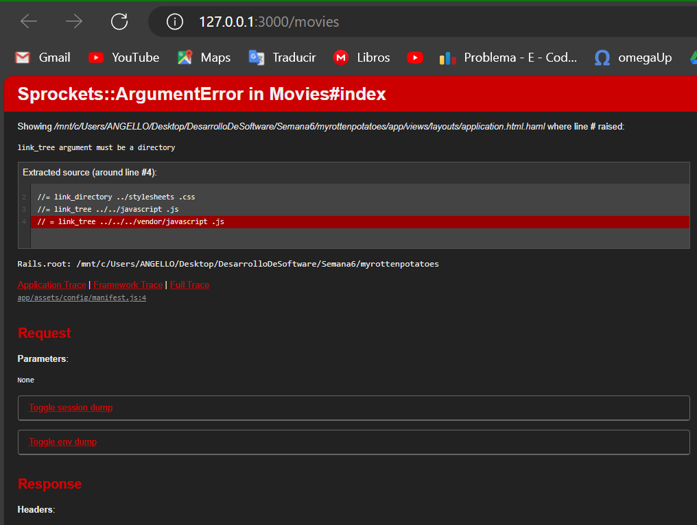
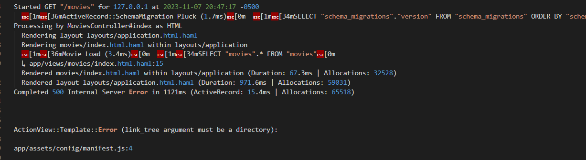
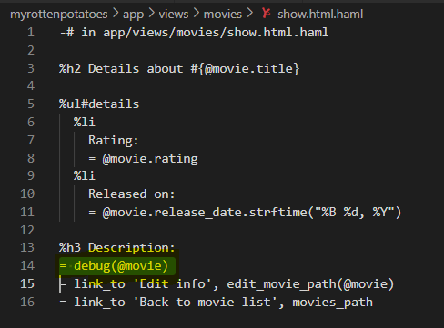
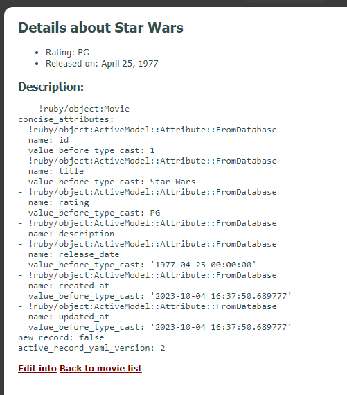
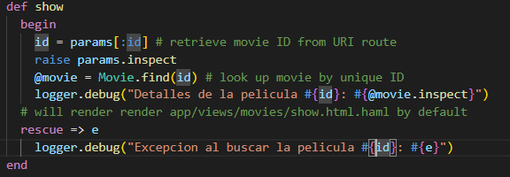
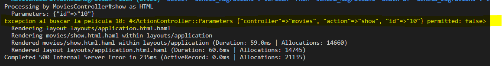
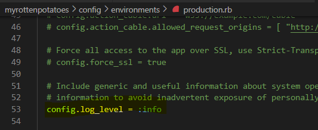

### Depuración SaaS en Rails ###
Al iniciar la aplicación `myrottenpotatoes` que clonamos del repositorio; obtenemos la siguiente respuesta:



Vemos el fichero de registro (`log file`), por lo general `log/development.log` para obtener la indormacion del error:



El cual nos indica que el argumento de `link_tree` debe ser un `directorio`

Ahora vamos a debuggear usando `debug`

Insertamos `= debug(@movie)` en la vista `views/movies/show.html.erb`:



Ahora vemos la descripción detallada del objeto en la vista:



Insertamos tambien en el controlador `movies_controller.rb`: 

```
def show
  begin 
    id = params[:id] # retrieve movie ID from URI route
    raise params.inspect
    @movie = Movie.find(id) # look up movie by unique ID
    logger.debug("Detalles de la pelicula #{id}: #{@movie.inspect}")
    # will render render app/views/movies/show.html.haml by default
  rescue => e
    logger.debug("Excepcion al buscar la pelicula #{id}: #{e}")
  end
end
```


Y obtenemos la excepción detallada en la salida de consola:



Nos piden comparar `enviroments/development.rb` con `enviroments/production.rb` para ver cómo difieren los niveles de registro por defecto entre los entornos:

En `enviroments/development.rb` se establece el `log_level` en ``info``, lo que quiere decir que registra eventos con nivel superior o igual a info.



En `enviroments/production.rb` no se establece el `log_level`, por lo que se establece por defecto en `debug`, lo que quiere decir que registra eventos con nivel superior o igual a ``debug``.


